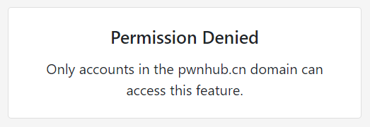
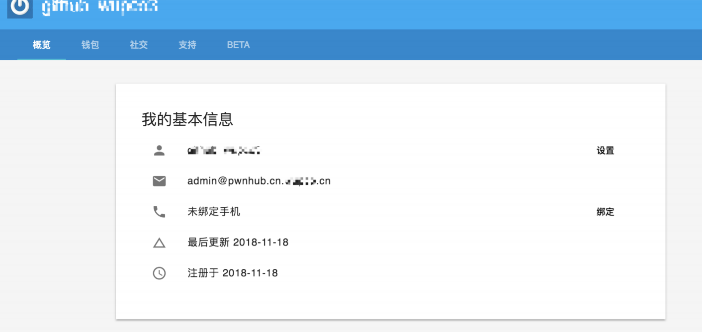

# EZ OAuth

> 题目描述：
> OAuth？都是假的。 1000 分点击就送： https://lctf.1slb.net/
>
> hint1: 不同接口可能实现类似
>
> hint2: accounts 换成 blog ，里面有一些提示

利⽤ `OAuth` 认证登录的系统，所采⽤的第三⽅为 [TYPCN Accounts](https://accounts.typcn.com/) 。题⽬应⽤从
`TYPCN Accounts` 获取⽤户的邮箱信息。

我们随便注册一个账户登录，发现题目返回错误页：

意思是账户邮箱在 `pwnhub.cn` 这个域下才可以使⽤正常功能。

由于不可能拿到这个域名的控制权，我们大胆猜测可能这里存在账户邮箱匹配不严谨的问题。我们假设系统只是匹配账户邮箱内存在 `@pwnhub.cn` 这个字符串，因此我们在自己的域名下添加一个 `pwnhub.cn.domain` 的 `MX` 记录，指向一个邮箱服务，或我们自己搭建的邮件服务器来接收验证邮件。成功注册账号：

同时成功进入系统。

后台发现有个两个接口，分别是 `/user/check` 和 `/admin/auth` 。后者没参数，前者的参数分别为 `domain` 和 `email` ，且 `domain` 为隐藏参数。

猜测其为验证服务器，将其改为自己的服务器，得知服务器发送数据；再本地模拟一下，得知服务器返回信息。发现这里有个极度麻烦的sign签名验证，经过测试，其至少和 `request-id` 和 `email` 存在关联。因此，我们很难修改回包。因为没有任何可控数据，也无法进行哈希长度扩展攻击。另外，我们发现 `/admin/auth` 也有一个隐藏的 `domain` 参数，其除了请求API以外，发送的数据和接受的数据与 `/user/check` 相同。

既然签名算法无法逆向，那只能进行大胆猜测了。

### 猜测一

常规思路，既然这道题是 lumen 框架的，而且接口返回是 JSON 格式，我们可以大胆猜测系统对返回的 `sign` 参数的判断存在弱类型问题。

因此我们直接给请求返回响应 `{code:200,result:true,sign:true}` ，发现果然可以，顺利拿到 flag 。

### 猜测二

奇葩思路，我们不知道 `result` 参数是否有在被 `sign` 算法涵盖的范围之内，如果它没有呢？

我们搭建一个 MITM 环境，将 `/admin/auth` 返回值中的 `result` 改为 `true` 其他参数不动，返回给服务器，顺利拿到 flag 。