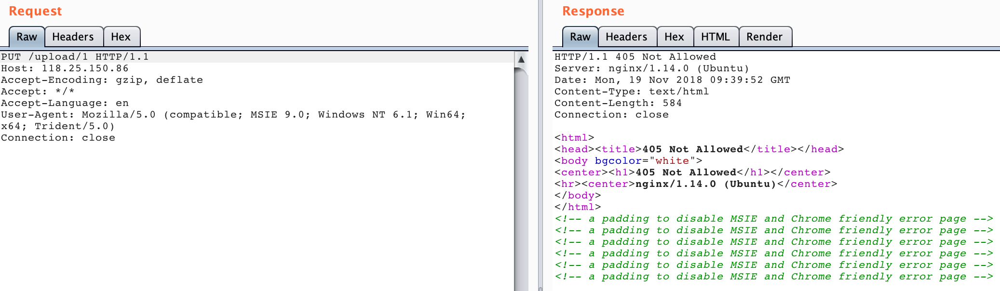
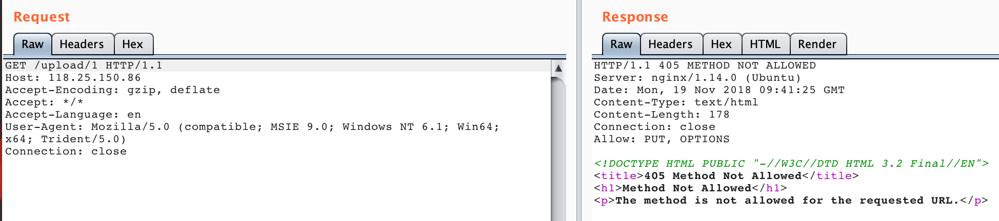
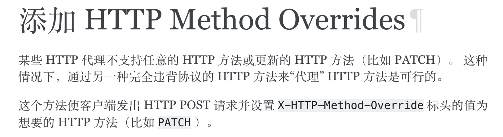
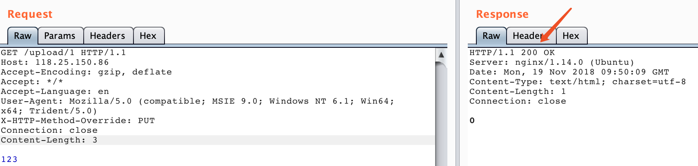
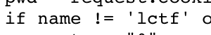
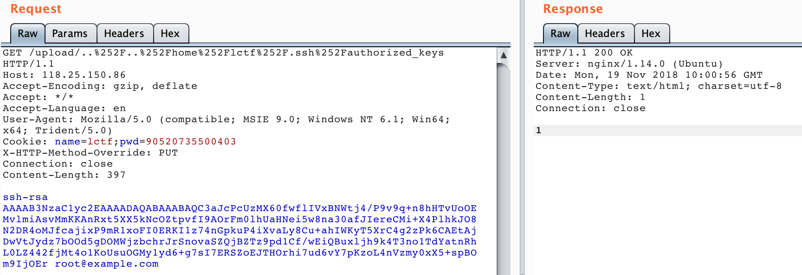
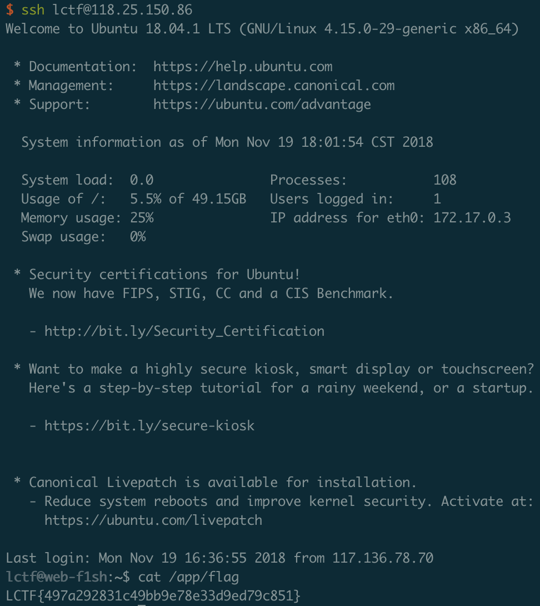

### Travel

这道题目的思路来源于两篇有趣的渗透报告：

[AWS takeover through SSRF in JavaScript](http://10degres.net/aws-takeover-ssrf-javascript/)

[An interesting Google vulnerability that got me 3133.7 reward.](http://www.sec-down.com/wordpress/?p=809)

第一篇渗透报告里作者通过SSRF请求AWS的`Cloud Instances`获得了大量敏感信息，所以好奇的我也查了一下国内的云服务商有没有这样的接口，发现其实都是有的：

[腾讯云文档-查看实例元数据](https://cloud.tencent.com/document/product/213/4934)

[阿里云文档-实例元数据](https://help.aliyun.com/knowledge_detail/49122.html)

这样我们就可以通过一些仅支持http/https的SSRF获得服务器的一些敏感信息，这也是我这道题目的第一个考点。我们可以通过请求`curl http://metadata.tencentyun.com/latest/meta-data/mac`获得服务器的mac地址，转换为十进制后就是`uuid.getnode()`的值。

获得了mac地址后我们按照代码里写的用`PUT`请求向`upload/`路由发请求，会发现返回405：

换成GET试试：

同样是405，但是我hint也也提示了留意**差异性**，其实说的就是这里。我们可以注意到两个405返回的页面是不同的，仔细看可以发现第一个405是nginx返回的，第二个405是flask返回的，也就是说我们的PUT请求实际上是在代理中被拦截了，没有实际发到后端。我们翻翻[flask文档](http://docs.jinkan.org/docs/flask/patterns/methodoverrides.html)可以发现这个问题是可以解决的：

所以我们只要添加`X-HTTP-Method-Override: PUT`在GET或者POST的请求头中就可以向后端发送一个PUT请求

此时加上cookie就可以向服务器上写入文件了，注意到代码里

这里会把filename再次url解码，所以我们可以把文件名二次编码，这样就可以跨目录写入文件。

获得任意文件写之后getshell一般有三种：

1. 写Webshell。但因为这道题是python web所以无效。

2. 写crontab。但这道题给的权限不够。

3. 写ssh公钥到`~/.ssh/authorized_keys`。这道题其实就是用这个思路，而且我还很贴心的提示大家用户名是lctf免得大家还需要猜测一下

   

所以最后写自己的ssh公钥到`home/lctf/.ssh/authorized_keys`即可：

