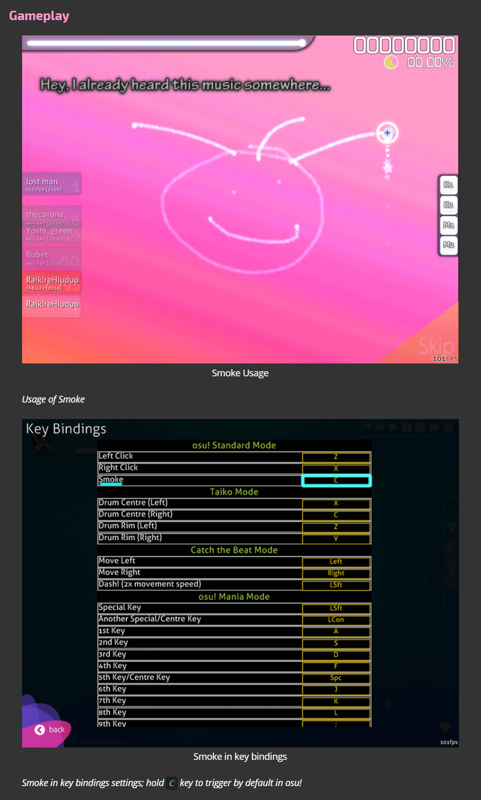
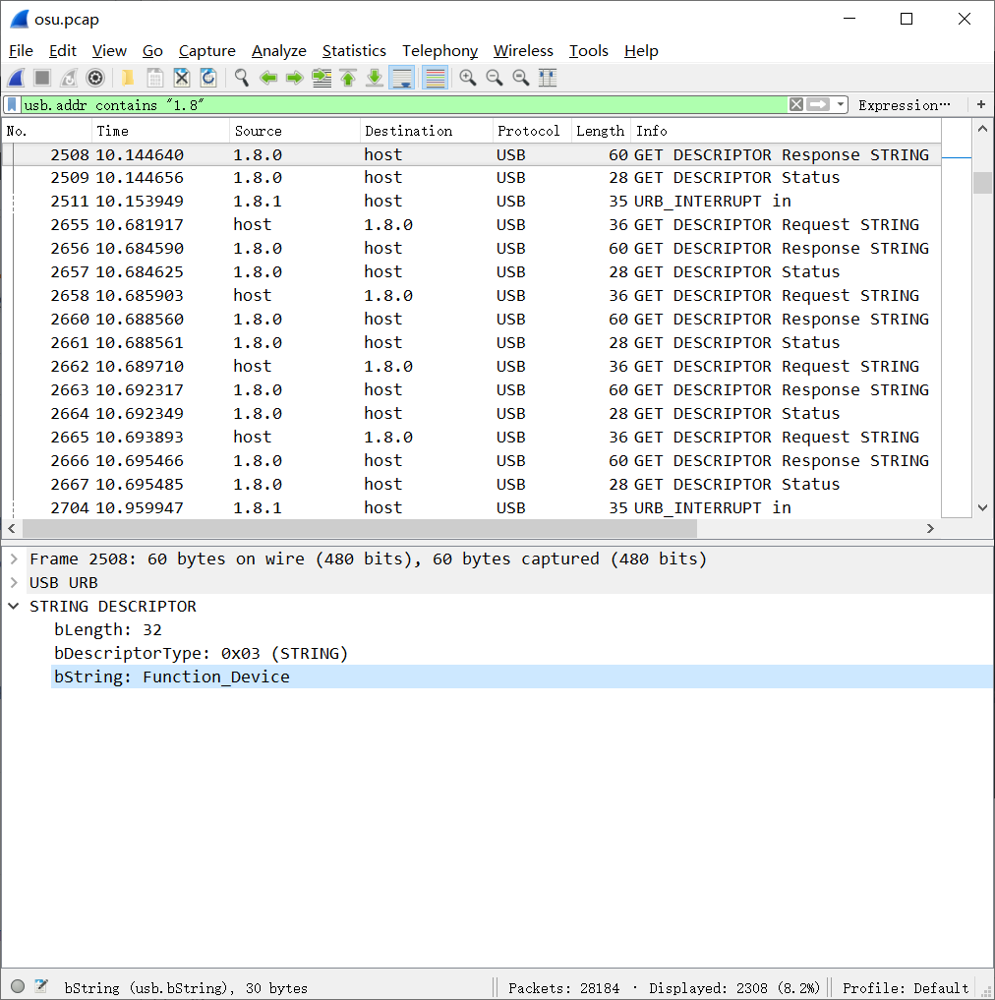
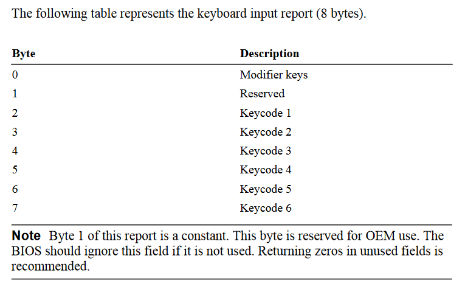

## Misc

### 你会玩osu!么？

> 题目描述：
> 你从未玩过的船新音游， osu.ppy.sh 了解一下 
> https://tundra-1257157477.cos.ap-chengdu.myqcloud.com/osu.pcap

题目给了一个 USB 流量包，首先我们用 Wireshark 打开看一下：


我们发现有多个设备的流量，而且整个捕获持续了很长时间，看来需要详细分析一下。

其中我们发现一个汇报为 `G102 Prodigy Gaming Mouse` 的罗技鼠标，但过滤后发现此设备的回报数据很少，没有什么价值。另外还发现一个汇报为 `CTL-472` 的设备，搜索一下发现是 Wacom 的数位板设备，是一个绝对坐标指针设备，而且它的汇报是等时间间隔(固定回报率)的。猜测可能是通过这个设备的移动轨迹提供信息。

二话不说上 `tshark` 过滤一下数据格式。

分析一下这个设备的数据，发现类似于如下格式：

`02:e1:76:2b:e5:13:54:02:1a:00`

其中第 3 和第 5 个 byte 变化幅度较小，第 2 和第 4 个 byte 变化幅度较大，可以猜测出是数位板的 `x` `y` 坐标，分别 2 个 byte ，小端。

`02:e1:x(76:2b):y(e5:13):54:02:1a:00`

同时我们还知道数位板设备是可以汇报笔接触板子的压力大小的，分析数据我们可以发现倒数第 3 个 byte 是压力：

`02:e1:x(76:2b):y(e5:13):54:pressure(02):1a:00`

同时我们可以查到，这个设备是可以在笔一定距离悬空时仍然检测到笔位置的，那么我们可以大胆猜测笔触板后的移动轨迹里藏着信息。经过分析后找到一个合适的 pressure 阈值，给 `CTL-472` 设备移动轨迹画图。

### The "Easier" Way

如果你有足够的耐心，还是可以找到数位板画 flag 的那一段时间的，只需要过滤出这段时间的数据，按照上面所说根据 pressure 画图，就可以得到比较清楚的结果，直接交题走人。

下面给出 `whitzard` 的脚本：

```python
import turtle as t

t.screensize(2400, 2400)
t.setup(1.0, 1.0, 0, 0)
keys = open('usbdata.txt')
i=0
for line in keys:
	i+=1
	if len(line) == 30 and i>3000:
		a0 = int(line[6:8], 16)
		a1 = int(line[9:11], 16)
		x = a0+a1*256
		b0 = int(line[12:14], 16)
		b1 = int(line[15:17], 16)
		y = b0+b1*256
		press = int(line[21:23], 16)
		if x!=0 and y!=0:
			t.setpos(x/20-500,-y/20)
			if press > 2:
				t.pendown()
			else:
				t.penup()
```


### The "Harder" Way

但画出来发现无用的线条太多了，我们是不是漏掉了什么过滤条件？

既然题目让我们了解一下这个船新音游，那我们就了解一下，打开 osu.ppy.sh ，点击导航栏 help 进入 wiki ，首先看一下默认游戏模式玩法： [https://osu.ppy.sh/help/wiki/Game_Modes/osu!](https://osu.ppy.sh/help/wiki/Game_Modes/osu!)

粗略翻了一下，大意就是用一个指针设备控制移动，`z` `x` 两个按键控制点击。不过在稍下面我们发现了一个有趣的东西：



意思是我们可以在游戏中按下 `c` 键的同时移动光标画画？

因垂丝汀，我们回头看一下完整的 pcap 包，发现这样一个设备：



这个设备在 `1.8.0` 汇报状态， `1.8.1` 进行数据通信，分析通信数据我们可以很容易看出这是一个典型的 USB HID Keyboard 。我们拿出所有 `1.8.1` 的数据，它们都是 8 byte 的，根据 USB UID spec ：



同时我们查表([链接](https://download.microsoft.com/download/1/6/1/161ba512-40e2-4cc9-843a-923143f3456c/translate.pdf))得到游戏默认三个按键的对应 keycode ：

`Z: 1D` `X: 1B` `C: 06`

那么我们只需要扫描第 2-7 byte 的值，找到任何一个 byte 值为 `06` 的数据包表示此时按下 `C` ，同时后续第一个没有任何 byte 值为 `06` 的数据包表示此时松开 `C` 。过滤出所有按下 `C` 的时间段内的来自 `1.7.1` 的数据，再画出数据所表示的点，即可得到清晰的 flag 图像。

至于 exp 脚本？这道题没有一个队伍使用此思路解题，所以留个课后练习，请大家自己动手尝试一下吧~